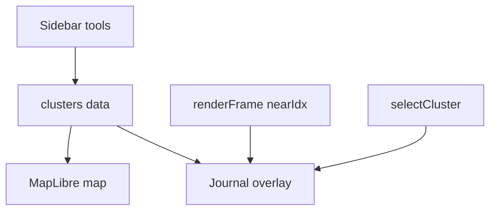

# 여행 저널 맵 오버레이 UI

시안처럼 지도 위에 라이트 저널 오버레이(요약·진행·스팟 카드·하단 통계)를 얹고, 업로드·스케일·색·아이콘 설정은 기존 사이드바에 둔다. 재생/클러스터 로직은 유지한 채 UI만 연결한다.

## 확정 범위 (하이브리드)

- **한다:** `#mapwrap` 위 라이트 카드 레이어 (시안 톤: 흰 카드·초록 accent·진행 점·하단 요약)
- **유지:** 사이드바(업로드·스케일·색·아이콘·도착 연출·장소 목록), 재생 카메라·dwell/travel·MP4 저장 로직
- **하지 않음(1차):** 앱 전체 라이트 테마 전환, 사이드바를 시안 스타일로 전면 재디자인

파일: `index.html`만.

## 레이어 구성 (시안 대응)

`#mapwrap` 안에 `#journalUI` (pointer-events 선택적) 추가:

| 영역 | DOM | 데이터 |
|------|-----|--------|
| 좌상단 메타 | `#jMeta` | 스케일 라벨(하루/도시/국가), 사진 수, 기간 첫날 |
| 상단 진행 | `#jProgress` | `현재스팟 / 전체` + 점 N개 (visited/current) |
| 우중 플로팅 카드 | `#jFloat` | 현재 스팟 썸네일·번호·이름·시각·사진 수 (재생 중·선택 시) |
| 하단 상세 시트 | 기존 `#detailpanel` 리스킨 | 대표 사진 + 이름·지역·시각·사진 수 (그리드/삭제/이름수정 유지) |
| 하단 요약 바 | `#jSummary` | 스팟 수 · 사진 수 · 일수 · 직선 km 합 |

타임라인(`#timeline`)은 요약 바 **바로 위**에 두고 스타일만 라이트 카드에 맞춤.

녹화 중에는 기존처럼 저널 오버레이·타임라인을 `visibility:hidden` (영상은 지도+핀 위주).

## 시각 톤

저널 오버레이 전용 CSS 변수 (사이드바 다크와 분리):

- 카드 배경 `rgba(255,255,255,.92)`, 텍스트 `#1a1a1a`, accent `#2f6b4f`(시안 초록) 또는 기존 `--progress`와 동기
- 그림자·둥근 모서리·얇은 아이콘 라인
- 지도는 기본 **light** basemap 유지 (저널과 맞춤). 다크 맵 토글은 그대로 두되, 카드는 라이트 고정

핀: 기존 `.photo-marker`에 **작은 캡션**(장소명·시각) — Marker **자식**에만 스타일 (루트 `transform` 금지). 재생 중에는 캡션 밀도 줄이기(현재+이웃만 또는 전부 약하게).

## 데이터·갱신 API

새 헬퍼 (기존 stats/클러스터 재사용):

- `tripMeta()` → `{ scaleLabel, photoCount, dateRange, dayCount, spotCount, totalKm }`
  - `totalKm`: 인접 클러스터 `haversine` 합 / 1000
  - `dayCount`: unique `c.day` 또는 날짜 span
- `refreshJournalUI(activeIdx)`
  - `buildClusters` / `setupAnimation` / `selectCluster` / `renderFrame`(nearIdx 변경 시)에서 호출
- 진행 점: `idx < reachedIdx` visited, `idx === nearIdx` current

플로팅 카드 클릭 → `selectCluster(i, true)` (상세 시트 오픈).

## 상세 시트 (`#detailpanel`)

시안 하단 카드에 맞게 리스킨:

- 좌: 대표 사진 큰 영역 / 우: 번호·제목·지역(역지오 또는 빈 값)·시각·`n / total` 사진
- 기존 `dpGrid`·편집·삭제는 접을 수 있는 하단 또는 시트 확장 시 표시 (기능 유지)
- PC: 하단 또는 우측 하단 대형 카드 / 모바일: 하단 시트 full-bleed

## 반응형

- `max-width: 820px`: 메타·진행 축소, 플로팅 카드는 하단 시트와 중복이면 플로팅 숨김(시트만)
- safe-area 패딩 유지
- 사이드바 열리면 저널 좌측 패딩 증가 또는 일시 축소

## 구현 단계

1. DOM + CSS 스켈레톤 — `#journalUI` 5구역, 라이트 카드 토큰, 타임라인 위치 조정
2. `tripMeta` / `refreshJournalUI` — stats·클러스터·재생 nearIdx 연결
3. 상세 패널 리스킨 — 시안 레이아웃 + 기존 편집/그리드 유지
4. 핀 캡션 — 자식 라벨, 재생 밀도 규칙
5. 녹화 chrome 목록에 `#journalUI` 포함해 숨김
6. 폴리시 — 빈 데이터 시 저널 숨김, 로딩 중 미표시

## Todos

- [ ] journalUI DOM/CSS 스켈레톤 + 타임라인 배치
- [ ] tripMeta + refreshJournalUI를 clusters/재생/선택에 연결
- [ ] detailpanel 시안형 리스킨 (편집/그리드 유지)
- [ ] photo-marker 자식 캡션 + 재생 밀도
- [ ] 녹화 시 journalUI 숨김 + 모바일/빈상태 폴리시

## 손대지 않는 것

- `computeSegments` / 카메라 추종 / arrivalMode move·popup 동작
- EXIF·클러스터링·MP4 인코딩 파이프라인
- 사이드바 컨트롤 기능 세트

## 완료 기준

- 사진 로드 후 지도 위에 시안형 메타·진행·요약이 보임
- 스팟 클릭/재생 시 플로팅·상세·점이 현재 스팟을 따름
- 미리보기·저장·사이드바 설정이 기존처럼 동작
- 모바일에서 카드가 맵을 과도하게 가리지 않음 (플로팅/시트 중 하나 우선)
